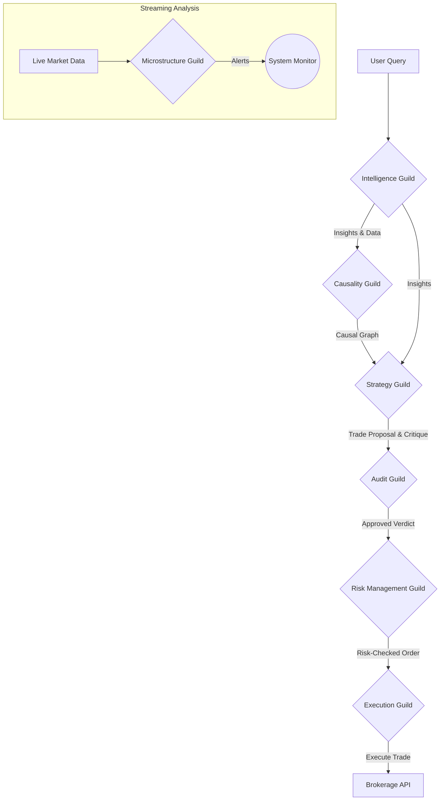

# 🏛️ Agora: An Autonomous AI Agent Framework for Financial Markets

[](https://www.python.org/downloads/)
[](https://www.apache.org/licenses/LICENSE-2.0)
[](https://github.com/msyber/agora)
[](https://github.com/msyber/agora)

**Agora** is a sophisticated, multi-agent AI framework designed to autonomously analyze financial markets, formulate strategies, and execute trades. It simulates a "digital agora"—a marketplace of ideas—where specialized AI agents collaborate, debate, and challenge each other to arrive at robust, evidence-backed financial decisions.

Built on Google's Agent Development Kit (ADK), Agora demonstrates how complex workflows can be orchestrated across a society of agents, each with a unique role and expertise.

---

### ✨ Key Features

- **🏛️ Guild-Based Architecture:** Agents are organized into "Guilds," each responsible for a specific domain: Intelligence, Causality, Strategy, Audit, Risk Management, and Execution.
- **🧠 LLM-Powered Cognition:** Leverages powerful Large Language Models (e.g., Gemini) for complex tasks like sentiment analysis, reasoning, and adversarial critique.
- **🤝 Collaborative & Adversarial Process:** Features a unique debate mechanism where a `DevilsAdvocate` agent challenges the `AlphaStrategist`'s proposals to ensure logical soundness.
- **🔒 End-to-End Risk Management:** Includes a `RiskGuardian` to enforce portfolio constraints and an `AuditorAgent` to impartially referee agent debates before any action is taken.
- **📦 Artifact-Driven Workflow:** Agents communicate and pass structured data through a versioned artifact system, ensuring a fully auditable and reproducible data lineage.
- **🌊 Real-time Streaming Analysis:** The `MarketMicrostructureAnalyst` can process live data feeds to detect market anomalies in real-time.
- **🧩 Modular & Extensible:** The framework is designed to be easily extended with new agents, tools, and data sources.

---

### 🏗️ System Architecture

Agora's workflow is a pipeline where data is progressively refined and analyzed by different guilds. The primary flow moves from broad data collection to a specific, risk-checked trade execution. A separate, parallel flow handles real-time streaming data.



#### The Guilds

1.  **Intelligence Guild:** Gathers raw information from external sources (news, filings) and refines it into structured, actionable insights.
    -   `DataHarvester`: Fetches raw data.
    -   `InsightMiner`: Uses an LLM to analyze data for sentiment and key summaries.
    -   `FundamentalAnalyst`: Extracts specific data from financial documents.

2.  **Causality Guild:** Analyzes insights to build a causal graph of potential market drivers.
    -   `CausalAnalyst`: Identifies cause-and-effect relationships from the data.

3.  **Strategy Guild:** Synthesizes all evidence to formulate and debate a trade idea.
    -   `AlphaStrategist`: Proposes a trade based on the evidence.
    -   `DevilsAdvocate`: Critiques the proposal, searching for logical flaws and unaddressed risks (a key part of the adversarial design).

4.  **Audit Guild:** Acts as an impartial referee to ensure the integrity of the strategy debate.
    -   `AuditorAgent`: Evaluates the proposal and critique, casting the final 'APPROVE' or 'VETO' vote.

5.  **Risk Management Guild:** Assesses an approved trade against portfolio-level risk limits.
    -   `RiskGuardian`: Checks position size, sector exposure, and other rules before creating a final trade order.

6.  **Execution Guild:** Submits the final, risk-checked order to the market.
    -   `ExecutionAgent`: Interfaces with a (mock) brokerage API to execute the trade.

7.  **Microstructure Guild:** Operates independently to analyze real-time market data streams.
    -   `MarketMicrostructureAnalyst`: Watches a live data feed for anomalies like wide bid-ask spreads.

---

### 🚀 Getting Started

Follow these steps to get Agora running on your local machine.

#### 1. Prerequisites

- Python 3.10+
- `git` for cloning the repository
- Access to a Generative AI model API (e.g., Google AI Studio or Vertex AI)

#### 2. Installation

```bash
# 1. Clone the repository
git clone https://github.com/your-username/agora.git
cd agora

# 2. Create and activate a Python virtual environment
python -m venv venv
source venv/bin/activate
# On Windows, use: venv\Scripts\activate

# 3. Install the required dependencies
pip install -r requirements.txt
```

#### 3. Environment Configuration

Agora uses a `.env` file to manage API keys and cloud configuration.

```bash
# 1. Copy the example file to create your own configuration
cp .env.example .env

# 2. Open .env in your editor and add your credentials
nano .env
```

You will need to provide your Google Cloud Project details or an API key for the generative models.

---

### 🏃‍♀️ Running the Demonstrations

Agora comes with several scripts in the root directory that demonstrate the functionality of different parts of the system.

#### Orchestrator and Intelligence Test

This test runs the `IntelligenceOrchestrator`, which in turn routes requests to the correct sub-pipelines. It demonstrates both the news analysis and fundamental analysis paths.

```bash
python run_orchestrator_test.py
```
*This will produce `MSFT_news_insights.json` and `NVDA_10K_risks_raw.txt` artifacts.*

#### Full Intelligence & Causality Pipeline Test

This test runs the full data-to-causality pipeline, generating a causal graph from news articles.

```bash
python run_full_pipeline_test.py
```
*This will produce a `MSFT_causal_graph.json` artifact.*

#### Risk & Execution Pipeline Test

This test demonstrates the final stages, where a pre-approved trade is checked for risk and "executed" via a mock broker API.

```bash
python run_execution_test.py
```
*This will produce a `MSFT_trade_confirmation.json` artifact.*

#### Real-time Streaming Test

This test showcases the `MarketMicrostructureAnalyst`'s ability to process a live feed of market data and generate alerts for anomalies.

```bash
python run_streaming_test.py
```
*This will run for 10 seconds, printing any detected alerts to the console.*

---

### 🛣️ Path to Production

The path to a live, alpha-generating system involves maturing this prototype into a production-grade application. This involves several key workstreams.

#### 1. High-Fidelity Data & API Integration
Our current agents use mock data and simulated APIs. The next major step is to connect them to the real world.

- **Intelligence Guild:** Replace the mock `fetch_news_articles` tool with a connection to a real-time news feed (e.g., Polygon.io, NewsAPI).
- **Execution Guild:** Replace the mock `submit_order` function with a real brokerage API (e.g., Alpaca, Interactive Brokers).

#### 2. Advanced Model Implementation
Our `Causal-Analyst` and `Risk-Guardian` use simplified, deterministic logic. To enhance their capabilities, we would:

- Implement a real statistical causal discovery algorithm within the `Causal-Analyst`.
- Develop a sophisticated portfolio optimization model for the `Risk-Guardian` to use.

#### 3. Rigorous Backtesting
Before deploying capital, we must validate our system's strategies against historical data. This involves building a backtesting engine that can:

- Feed years of historical market data, news, and filings into our agent pipeline.
- Simulate the execution of the agents' decisions.
- Measure the historical performance (Profit & Loss, Sharpe Ratio, Max Drawdown) of the AGORA system.

#### 4. Production Deployment (Microservices)
A production deployment would run on a scalable infrastructure like Kubernetes. We would:

- Containerize our guilds into independent microservices.
- Deploy the "slow lane" (Intelligence, Causality, Strategy) and "fast lane" (Microstructure) as separate, scalable services.
- Use the ADK's A2A (Agent-to-Agent) Protocol for communication between these services.

#### 5. Monitoring and Human-in-the-Loop
A live system requires robust monitoring. We would build a dashboard to:

- Visualize the flow of artifacts through the pipeline in real-time.
- Review all trade proposals, critiques, and audits.
- Provide a human Portfolio Manager with the ability to manually override any decision, ensuring final control.

---

### 📁 Project Structure

```
agora/
├── guilds/
│   ├── audit/                # Referee agent
│   ├── causality/            # Causal analysis agent
│   ├── execution/            # Trade execution agent
│   ├── intelligence/         # Data gathering & processing agents
│   ├── microstructure/       # Real-time streaming agent
│   ├── risk_management/      # Portfolio risk-checking agent
│   └── strategy/             # Strategy formulation & debate agents
├── .env.example              # Example environment configuration
├── requirements.txt          # Project dependencies
├── run_*.py                  # Test and demonstration scripts
└── README.md                 # This file
```

---

### 🤝 Contributing

Contributions are welcome! If you'd like to improve Agora, please feel free to fork the repository and submit a pull request. For major changes, please open an issue first to discuss what you would like to change.

1.  Fork the Project
2.  Create your Feature Branch (`git checkout -b feature/AmazingFeature`)
3.  Commit your Changes (`git commit -m 'Add some AmazingFeature'`)
4.  Push to the Branch (`git push origin feature/AmazingFeature`)
5.  Open a Pull Request

---

### 📜 License

Distributed under the Apache License, Version 2.0. See `LICENSE` for more information.

---

### 🙏 Acknowledgments

- Google Agent Development Kit (ADK)
- Pydantic
- LiteLLM